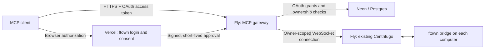

# HTTPS MCP gateway

ftown exposes MCP as a remote **Streamable HTTP endpoint over HTTPS**, with OAuth authorization through the existing ftown login. There is no MCP stdio mode.

## Deployment architecture



The gateway is a **separate Fly app**, alongside the existing `ftown-centrifugo` app. Its public URL ends in `/mcp`. Fly terminates TLS; the container listens on its internal HTTP port. The existing Vercel UI hosts `/mcp/consent` and reuses the current NextAuth login. OAuth state lives in the same Postgres database as ftown's users and device ownership records.

Computers connect outward to Centrifugo as they already do. The recommended `relay` transport does not need inbound ports or SSH credentials on workers. Each worker must run this bridge build to support the `mcp_request` command and stop/retry routes. The local bridge credential is used only on the worker and is never sent through the relay.

## Deployment checklist

The production gateway is `https://ftown-mcp.fly.dev/mcp`, in Fly organization `ftown`. The consent page is deployed to `https://ftown.ia.br/mcp/consent` in the existing Vercel project. The initial rollout applied migration `0004_mcp_oauth.sql` and registered four paired computers belonging to the owner of the configured anchor bridge. Computer bridges still need the new build before they can answer MCP requests.

The following steps describe setup and recovery:

1. Apply `ui/migrations/0004_mcp_oauth.sql` using the existing migration workflow. It adds one table and an expiry index. The fresh-install `ui/schema.sql` includes the same definitions.
2. Deploy the UI changes to its existing Vercel project with these server-only environment variables:
   - `FTOWN_PUBLIC_URL`: canonical ftown UI HTTPS origin, e.g. `https://ftown.ia.br`, without a trailing slash.
   - `FTOWN_MCP_PUBLIC_URL`: canonical gateway HTTPS origin, e.g. `https://ftown-mcp.fly.dev`, without a trailing slash.
   - `FTOWN_MCP_APPROVAL_SECRET`: a new random secret of at least 32 characters, shared only with the gateway. Do not reuse the NextAuth or Centrifugo key.
3. Configure the gateway using `deploy/mcp/gateway.example.json`. Each machine `id` is its actual ftown bridge ID; `userId` is the bridge owner's account email. Each access `subject` is the immutable `users.id`, not an email address. The configured access list is an additional restriction: current database device ownership and revocation are also checked at consent and on every authenticated MCP request.
4. Set Fly secrets through your secret manager or Fly's secret input mechanism:
   - `FTOWN_MCP_CONFIG_JSON`: the complete gateway JSON config, or use `FTOWN_MCP_CONFIG` to name a mounted file.
   - `DATABASE_URL`: the existing ftown Postgres database with the OAuth migration applied.
   - `FTOWN_MCP_APPROVAL_SECRET`: the same new secret as the UI.
   - `CENTRIFUGO_URL`: existing relay's `wss://…/connection/websocket` URL.
   - `CENTRIFUGO_TOKEN_SECRET`: existing relay signing key, needed to create short-lived owner-scoped relay connections. OAuth access tokens are never forwarded to Centrifugo.
5. Build/deploy from the repository root using the new app's config, after confirming the deployment target:

```sh
fly deploy --config deploy/mcp/fly.toml --ignorefile deploy/mcp/.dockerignore
```

6. Upgrade/restart the computer bridges with this build. Verify `/healthz`, OAuth discovery, and an end-to-end grant against a test account before enabling production users.

`deploy/mcp/Dockerfile` builds only the gateway's runtime requirements; PTY/WebRTC native install scripts are skipped because the hosted process does not launch agents locally. The runtime is non-root. The Fly config requires HTTPS, keeps one instance warm, and has a liveness check.

The `Deploy HTTPS MCP gateway to Fly` workflow uses the app-scoped `FLY_MCP_API_TOKEN`, separate from the broker's deploy token. It takes the database and broker credentials from existing GitHub secrets and shares `FTOWN_MCP_APPROVAL_SECRET` with the production Vercel project. `FTOWN_MCP_OWNER_BRIDGE_ID` identifies an existing, non-revoked bridge; deployment derives only that owner's active computers from the database. Re-run the workflow after pairing another computer to refresh the gateway registry. Rotate the app deploy token before its 30-day expiry. Never print or upload the generated runtime secret bundle.

Initial deployment evidence: [database migration](https://github.com/fmktech/ftown/actions/runs/38008247315), [gateway build, tests and deployment](https://github.com/fmktech/ftown/actions/runs/38008464435). The gateway image was built from `5ebbdf2`; the production consent UI was built from `3c442a2`.

For local development behind a TLS reverse proxy:

```sh
cd bridge
npm ci
npm run build
node dist/mcp-cli.js --config /absolute/path/gateway.json
```

The gateway defaults to `127.0.0.1:8080`; the Fly image sets `HOST=0.0.0.0`. Never expose its internal HTTP listener directly to the public internet: the configured ingress is the trusted TLS boundary.

## Connect an MCP client

Add a remote MCP server using your deployed URL:

```text
https://YOUR-MCP-HOST/mcp
```

Use the client's OAuth connection flow. It discovers the authorization server, registers a public client, opens ftown's login/consent page, and exchanges its authorization code using PKCE. The user selects which owned computers to authorize.

There is no local command to launch in the MCP client, and no bridge token to paste into it. Clients must support Streamable HTTP, public OAuth clients with S256 PKCE, and resource indicators. HTTPS browser clients must also have their origin added to `allowedOrigins` in gateway config. Non-browser clients normally omit `Origin`.

## OAuth behavior

- Discovery: `/.well-known/oauth-protected-resource/mcp` and `/.well-known/oauth-authorization-server`; unauthenticated MCP calls return a `WWW-Authenticate` discovery challenge.
- Endpoints: `/register`, `/authorize`, `/token`, `/revoke`. Registration supports public clients (`token_endpoint_auth_method=none`); confidential-client secrets and client-credentials grants are not implemented.
- Authorization uses S256 PKCE, registered redirect validation, explicit browser consent, and a code bound to the client, exact redirect URI, and `/mcp` resource. Codes expire in two minutes and are consumed atomically.
- `mcp:read` allows inspection, history/search, usage and non-consuming inbox observation. `mcp:control` additionally allows session creation/lifecycle, mail sending/broadcast, and terminal input. Write tools are absent from a read-only grant's tool surface, including the mixed-operation batch tool.
- Opaque access tokens expire after 15 minutes. Refresh grants expire after 30 days. Every refresh rotates the refresh token; reuse revokes the entire grant, including issued access tokens. Refresh cannot expand scopes.
- `/revoke` revokes the entire associated grant. Device revocation and configured access removal also prevent subsequent MCP access. Already-dispatched work is not rolled back by revocation.
- Raw OAuth access/refresh tokens and authorization codes are not stored: token records use SHA-256 keys. Account ownership is read from `users` and `bridge_refresh` on every request. Expired records are pruned in bounded batches during ordinary database operations.
- The consent UI sends a 60-second assertion directly to the gateway. It is audience-, issuer-, purpose-, subject- and request-bound; the browser never receives this assertion. Approval requests are one-use. Next.js server actions enforce the browser action boundary.
- OAuth grants and refresh rotation are shared in Postgres, including transaction locks to serialize refresh rotation. MCP HTTP handling is stateless; it does not require sticky sessions. Connection pools, limits and relay request deduplication remain per process.

The implementation uses the [official MCP SDK](https://ts.sdk.modelcontextprotocol.io/server) for transport and OAuth endpoint handling, following [MCP's HTTP authorization model](https://modelcontextprotocol.io/specification/latest/basic/authorization).

## Fleet configuration

```json
{
  "publicUrl": "https://ftown-mcp.fly.dev",
  "loginUrl": "https://ftown.ia.br",
  "allowedOrigins": [],
  "fleet": {
    "concurrency": 8,
    "timeoutMs": 15000,
    "machines": [
      {
        "id": "ACTUAL_BRIDGE_ID",
        "label": "Build workstation",
        "transport": "relay",
        "userId": "owner@example.com"
      }
    ]
  },
  "access": [
    { "subject": "USER_DATABASE_ID", "machines": ["ACTUAL_BRIDGE_ID"] }
  ]
}
```

Machine registration is currently explicit, not automatic cloud discovery. Gateway config changes take effect on restart; database device revocation is checked live. Adding a machine requires pairing it to the user's account, adding it to the gateway config, and granting access through OAuth.

Alternative fleet transports remain available: `local` reads the gateway host's bridge credential file; `ssh` runs the private `ftown-mcp --proxy` bridge helper; `http` uses an authenticated HTTPS origin or loopback tunnel and a server-side `tokenEnv`. These are backend transports, not MCP stdio. All machine IDs still have to correspond to owned ftown devices. Relay is the intended hosted default.

## Tools and workflow

| Tool | Purpose |
| --- | --- |
| `machines_list` | Authorized hosts, connectivity and session counts |
| `sessions_list` | Filtered, paginated inventory with per-host errors |
| `sessions_create` | Launch a harness with prompt, model, directory and optional parent |
| `sessions_get`, `sessions_update` | Inspect, rename and reparent |
| `sessions_stop`, `sessions_retry` | Stop a process or rerun its stored command |
| `sessions_remove`, `archive_list`, `sessions_revive` | Archive/remove and recreate |
| `sessions_running`, `sessions_usage`, `sessions_wait` | Liveness, usage and bounded status waiting |
| `chats_read`, `chats_search`, `chats_search_fleet` | Retained terminal conversation history and search |
| `messages_send`, `messages_read`, `messages_broadcast` | Durable threaded mail and non-consuming observation |
| `terminal_input`, `terminal_resize`, `terminal_clear` | Exact terminal control |
| `fleet_batch` | Up to 50 independent operations with individual results |

Discover machines → list sessions → create tasks → retain each **machine/session ID pair** → send follow-ups or search/read results → inspect usage and clean up. Broadcast supports up to 200 explicit target pairs. `ftown://guide` provides this workflow to MCP clients. Cron and factory administration remain excluded.

## Operational limits

- This has not been load-tested against hundreds of real computers. Centrifugo's existing configured connection limits still constrain the overall system; the gateway adds one renewable WebSocket connection per configured account it accesses.
- Concurrency defaults to 8, maximum 32, shared across requests within one gateway process. Additional gateway replicas multiply that limit. Deployment replica counts and quotas need capacity testing.
- Requests have deadlines and cancellation; neither cancels work already dispatched to a remote process. Batch operations are independent, not transactional. No mutation retries occur. `outcomeUnknown=true` requires reconciliation before retrying.
- Relay commands are explicitly targeted, expire, and reject cron/factory routes. Duplicate request IDs are deduplicated for two minutes within a worker process. This is not a persistent exactly-once guarantee across worker restarts.
- Relay responses are capped at 400 KB; use smaller pages if a result exceeds that size. Fleet inventory is currently fetched in full from each bridge before gateway pagination, so extremely large bridge inventories require future bridge-side pagination.
- HTTP requests reconstruct a scoped MCP server; there is no durable SSE replay or reconnect event log. New requests authenticate again after reconnecting.
- Mail enqueueing is not acknowledgment. Inbox reads peek and never steal mail from native agent hooks. `sessions_wait` observes process status, not model-turn completion.
- Chats are retained terminal scrollback, not complete native role-labelled transcripts. Character budgets and continuation offsets bound history responses; live redraws or retention can shift offsets.
- Setup requires a real database migration, shared secrets, a verified Fly app/domain and upgraded worker bridges. Local tests do not prove the deployed OAuth callback/DNS/TLS path.

## Verification

```sh
cd bridge
npm run build
node --import tsx --test src/mcp/*.test.ts src/command-rpc.test.ts src/local-api-server.test.ts src/session-controller.test.ts
# Optional real, isolated Centrifugo v5 test:
FTOWN_TEST_CENTRIFUGO=/path/to/centrifugo node --import tsx --test src/mcp/relay.integration.test.ts
cd ../ui
npm test -- --run src/lib/mcp-consent.test.ts
npx tsc --noEmit
```

OAuth HTTP tests exercise PKCE, code replay, account/machine isolation, read-only tool permissions, refresh replay and revocation against an isolated transactional store. The production Postgres adapter and real Vercel→Fly→worker deployment still need infrastructure integration testing.
